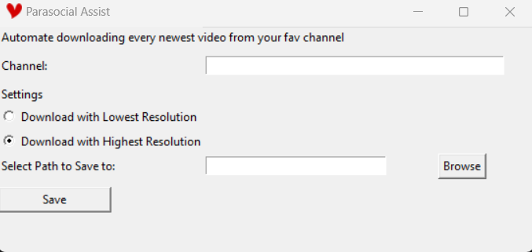
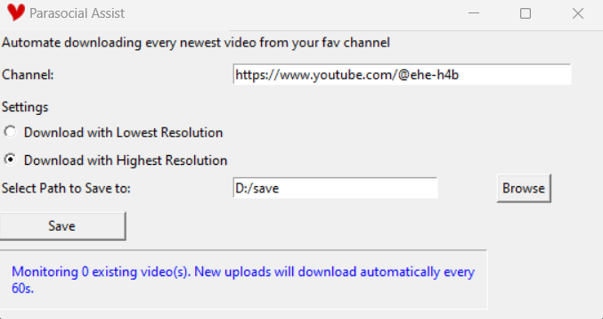
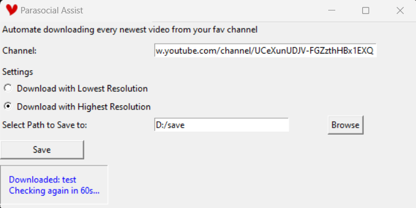

# 🥀💔 Parasocial Assist 💔🥀

> *Tbf a pro parasocial wouldnt miss any yt notification anyway. This is jst for downloading ykyk? Like what if they privated video or posted wrong video. "GAHHHHH THEY PRIVATED IT NOOOOOO WHY WOULD YOU DO THAT" urgh uhhh uhhh me when the when me when the uh* 💔💔💔💔💔💔💔💔💔💔

##  Disclaimer 

**This project exists purely because I was bored. It's on windows only btw cuz this is a self-indulgent pj idc.** 💖


---

##  What is this????!!???

**Parasocial Assist** can errhhhmmm:

🥀 Automatically monitors a YouTube channel<br>
🥀 Checks for newly uploaded videos every 60 seconds<br>
🥀 Downloads new uploads automatically<br>
🥀 Lets you choose the download quality<br>
🥀 Lets you pick where videos are saved<br>
🥀 Plays a notification sound when downloads finish<br>

Basically, it's a tiny assistant for your completely normal and definitely not parasocial relationship with your fave (ehe 🥺)

 


---

##  Installation 

### Clone the repository (pls don't actually idk what im doing)

```bash
git clone <your-repository-url>
cd parasocial-assist
```

### Install dependencies

```bash
pip install -r requirements.txt
```
---
## 💔🥀 Usage 🥀💔

Run the application:

```bash
python main.py
```
or
```bash
python GUI.py
```
^ any work btw

Or just download the exe ver like a normal human idk. Point is I havent test thoroughly the exe ver tho so uh if it bugged out jst run the acoustic way. 

---

##  Supported Channel URLs 

Examples:

```text
https://www.youtube.com/@channelname
https://www.youtube.com/channel/CHANNEL_ID
https://www.youtube.com/c/channelname
https://www.youtube.com/user/channelname
```

---


